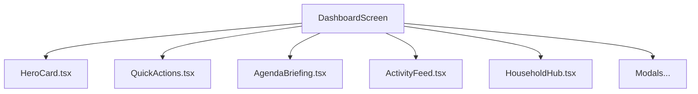

# Dashboard Enhancements & Optimization Blueprint

This blueprint outlines a list of recommended features to increase the functionality of the [DashboardScreen](file:///home/jeevan/Desktop/my%20projects/shared%20living/src/screens/DashboardScreen.tsx) and structural/UI optimizations to improve app performance and code maintainability.

---

## 1. Functional Features Plan

To make the dashboard more useful and interactive for flatmates, we propose the following feature sets:

### A. Quick Action Widgets ("Shortcuts")
Currently, users must navigate to individual tabs (Grocery, Expense, Chores, Chat) to perform tasks. 
* **Proposal**: Add a row of quick-action buttons directly on the Dashboard.
  * **Quick Buy**: Instantly log a grocery item without opening the grocery screen.
  * **Settle Up**: A one-tap button to initiate a peer-to-peer balance settlement.
  * **Log Quick Expense**: A simplified expense popup (e.g., Title & Amount) with equal split by default.
  * **Log Chore**: Quick-add a task for today.

### B. Shared Sticky Notice Board
A digital "fridge magnet" note card on the dashboard for short-lived, transient household announcements.
* **Examples**: *"Gas cylinder arriving between 2-4 PM today"*, *"Gone home for the weekend, call me if needed"*, *"Key is under the doormat"*.
* **Implementation**: A simple text card in the hero area where any roommate can tap to edit/update in real-time (backed by a single Firestore doc).

### C. Live Roommate Presence / Status Indicator
Helps flatmates see at a glance who is around.
* **Proposal**: Status badges or dots on roommate avatars:
  * 🟢 **Home** (Can be automated via Geofencing/Wi-Fi connection status or toggled manually)
  * 🟡 **Out** / Busy
  * 💤 **Sleeping**
  * ✈️ **Away** (on vacation)

### D. Integrated Household Calendar & Event Timeline
A chronological vertical timeline of today's activities:
* Reminders of chores due.
* Trash truck countdown.
* Birthdays or house events (e.g., "House cleaning day", "Owner visiting").

---

## 2. UI & Performance Optimization Plan

The [DashboardScreen.tsx](file:///home/jeevan/Desktop/my%20projects/shared%20living/src/screens/DashboardScreen.tsx) file is currently **2,650+ lines of code**. This consolidation introduces significant rendering bottlenecks and makes maintenance difficult. We recommend a staged refactoring plan.

### A. Component Modularization (Deconstruction)
We should split the massive file into dedicated, specialized sub-components. This confines state changes (like typing in a text field or toggling a checkbox) to individual components and avoids re-rendering the entire dashboard.

* **Action Items**:
  1. Extract modals into `/src/components/modals/`:
     * `HouseholdSwitcherModal.tsx`
     * `MembersModal.tsx`
     * `NotificationsModal.tsx`
     * `InfoEditModal.tsx`
  2. Extract sections into `/src/components/dashboard/`:
     * `HeroGreeting.tsx`
     * `ActivityFeedList.tsx`
     * `InfoCardsDeck.tsx`

### B. Custom State Hooks & Context Extraction
Remove data-fetching logic and raw Firestore listeners from `DashboardScreen.tsx`.
* **Proposal**: Create a custom React hook `useDashboardData.ts` to manage:
  * Real-time Firestore subscriptions for chores, groceries, expenses, and activities.
  * Trash truck timers and calculation logic.
* **Benefit**: The UI component only consumes the computed data, separating business logic from rendering code.

### C. FlatList & ScrollView nesting optimization
Nesting scrollable components (like placing list items inside a root `<ScrollView>`) ruins list virtualization in React Native, leading to memory leaks and high CPU usage.
* **Proposal**: Change the root container to a single unified `FlatList` where sections (Hero, Shortcuts, Hub Deck) are treated as `ListHeaderComponent` items, and the Activity Feed is rendered as the main list.

### D. Render Optimizations & Image Caching
* **`React.memo` & `useCallback`**: Ensure list item renderers (e.g., activity feed items) are memoized, and their click-handlers are wrapped in `useCallback` to avoid regenerating functions on every tick of the trash truck countdown.
* **Fast Image Caching**: Swap standard React Native `<Image>` tags for `expo-image` to support high-performance disk caching of profile avatars.

---

## 3. Verification & Execution Phases

| Phase | Goal | Actions |
| :--- | :--- | :--- |
| **Phase 1** | **Architectural Refactoring** | Separate Firestore queries into a custom hook and extract the major Modals out of the main dashboard file to reduce file length. |
| **Phase 2** | **Performance & List Fixes** | Flatten nested scrollables and optimize re-renders using `React.memo` and `useCallback`. |
| **Phase 3** | **Features Rollout** | Build the Quick Actions widget, Sticky Notice Board, and Roommate Presence indicators. |
