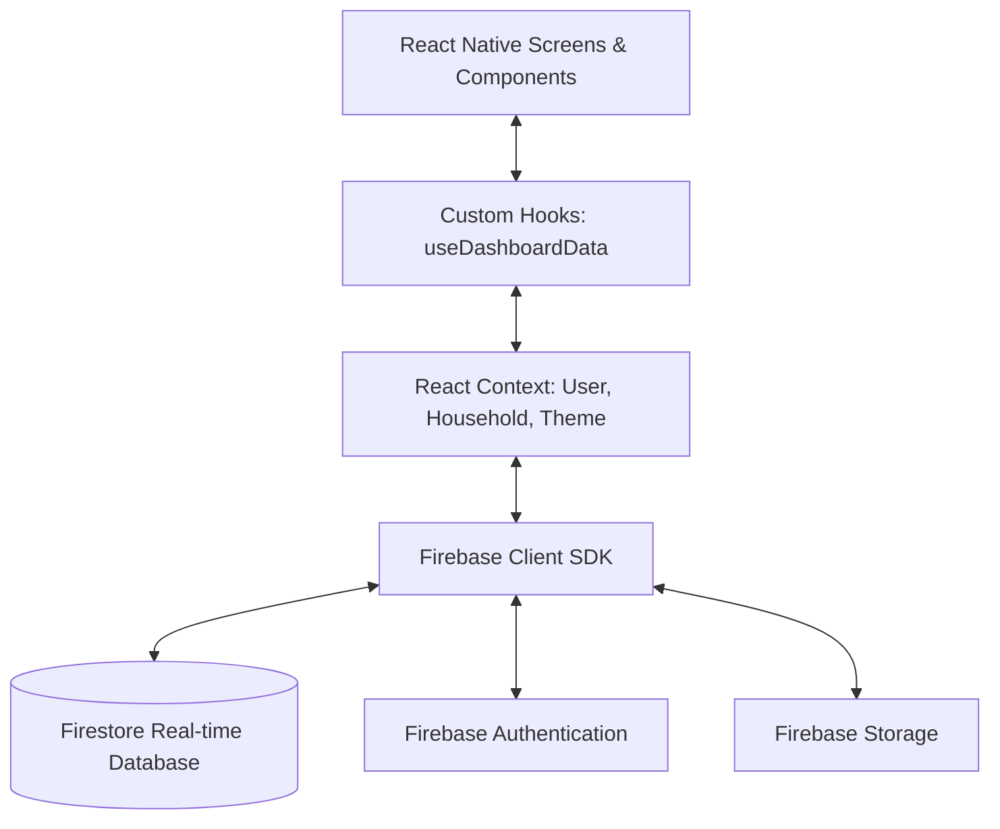
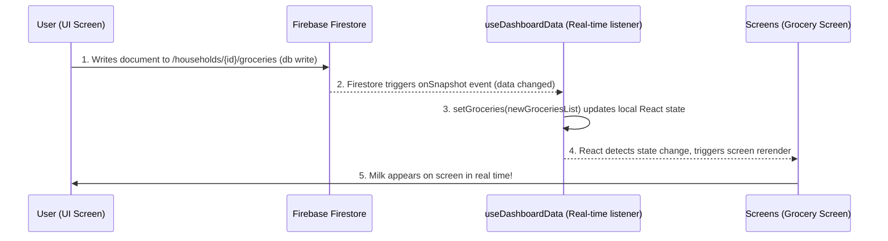

# Deep-Dive Learning & Codebase Guide: Shared Living App

Welcome! Vibe coding is an incredible superpower for bootstrapping functional apps quickly. However, moving from *having a running app* to *deeply understanding every line of code* is the transition that turns you into a professional engineer. 

This guide acts as your personalized roadmap and study plan. It breaks down your specific codebase, details how the data flows, explains core React and Firebase concepts, and sets up a phase-by-phase learning path.

---

## 🗺️ System Architecture (How the Parts Fit Together)

Your application is a mobile app named **Shared Living**. It helps roomies/flatmates manage chores, track groceries, split expenses, and chat.

Here is the high-level architecture:



### 1. The Shell: React Native & Expo
* **What it does**: Renders native UI elements (buttons, inputs, lists) on both iOS and Android from a single TypeScript codebase.
* **Key file**: [App.tsx](file:///home/jeevan/Desktop/my%20projects/shared%20living/App.tsx) binds all wrappers and routes the user. If they aren't logged in, they see `LoginScreen`. If they don't have a household, they see `HouseholdSelection`. Once verified, they enter the main application.

### 2. The Face: Tailwind (NativeWind)
* **What it does**: Lets you style your components directly in the code using CSS-like utility classes (e.g., `className="flex-1 bg-slate-900 justify-center items-center"`).
* **Key files**: [global.css](file:///home/jeevan/Desktop/my%20projects/shared%20living/global.css) and [tailwind.config.js](file:///home/jeevan/Desktop/my%20projects/shared%20living/tailwind.config.js).

### 3. The Brains: React Context & Custom Hooks
* **What it does**: Holds state (variables) in memory so screens can display data, and updates that state when database events occur.
* **Key context**: [HouseholdContext.tsx](file:///home/jeevan/Desktop/my%20projects/shared%20living/src/context/HouseholdContext.tsx) monitors which household is active and fetches profiles for all members.
* **Key hook**: [useDashboardData.ts](file:///home/jeevan/Desktop/my%20projects/shared%20living/src/hooks/useDashboardData.ts) handles real-time database listeners for chores, groceries, messages, and expenses, calculates debts, and runs intervals (like the trash truck countdown).

### 4. The Backbone: Firebase
* **What it does**: Stores data permanently and syncs it across devices in real time.
* **Key file**: [firebaseConfig.ts](file:///home/jeevan/Desktop/my%20projects/shared%20living/src/firebaseConfig.ts) connects your app to your Firebase project.

---

## 🔄 Tracing the Data: How Features Actually Work

To understand this codebase, you must understand how data travels. Let’s trace two key examples.

### Case Study A: Adding a Grocery Item
When you or a flatmate adds a grocery item (like "Milk"), this is what happens:



1. **The Write**: You type "Milk" on the UI and tap Add. The screen calls Firestore's `addDoc` on the `groceries` subcollection inside the active household document.
2. **The Database Sync**: Firestore writes the document. Because Firestore is a real-time database, it instantly updates all clients listening to that subcollection.
3. **The Hook Listener**: In [useDashboardData.ts](file:///home/jeevan/Desktop/my%20projects/shared%20living/src/hooks/useDashboardData.ts#L264-L282), this listener runs:
   ```typescript
   const q = query(collection(db, "households", householdId, "groceries"), ...);
   onSnapshot(q, (snap) => {
     const fetched = snap.docs.map(d => ({ id: d.id, ...d.data() }));
     setGroceries(fetched); // Updates state
   });
   ```
4. **The UI Update**: When `setGroceries` runs, React notices the `groceries` state changed. It automatically rerenders any screen displaying the list, showing "Milk".

---

### Case Study B: Calculating Balances (Debts)
How does the app know you owe a flatmate money? Let's trace the math inside [useDashboardData.ts](file:///home/jeevan/Desktop/my%20projects/shared%20living/src/hooks/useDashboardData.ts#L410-L459):

1. **Fetching Expenses**: The hook listens to all expense documents in Firestore and keeps them in the `expenses` state.
2. **Starting from Zero**: It creates an empty map of roommate balances:
   ```typescript
   const peerBalances: Record<string, number> = {};
   ```
3. **Iterating Over Every Transaction**:
   * If it's a **shared expense** (e.g., Roommate A paid ₹900 for internet split among 3 people):
     * The split share is ₹300 per person.
     * If you are a split-member, your debt to Roommate A increases by ₹300.
     * If you are Roommate A, others owe you ₹300 each.
   * If it's a **settlement payment** (e.g., You paid Roommate A ₹300 directly):
     * Your debt to Roommate A decreases by ₹300.
4. **Filtering and Formatting**:
   ```typescript
   Object.entries(peerBalances).forEach(([uid, amount]) => {
     if (amount > 0.01) {
       items.push({
         type: "debt",
         title: `You currently owe ${name} ₹${Math.ceil(amount)}.`,
         // ...
       });
     }
   });
   ```
5. **Agenda items**: This dynamic balance calculation is outputted into `agendaItems`, which populates the dashboard's main feeds.

---

## 🧠 Demystifying Core Concepts

If you "vibe coded" this, some React concepts might feel magical. Let's break them down:

### 1. What are React Hooks?
React hooks are functions that let you tap into React features (like state management and lifecycle methods).
* **`useState`**: Tells React: *"Remember this value. If I change it using the set function, redraw the screen."*
* **`useEffect`**: Tells React: *"Run this side effect (like checking a database or starting a timer) when specific variables change."*
* **`useMemo`**: Tells React: *"Calculate this complex value (like debts) once. Don't recalculate it on every single render unless the input arrays change."*
* **`useRef`**: Holds a mutable value that persists across renders, but changing it **does not** trigger a screen redraw. (Used in your code to track the last time you checked activities).

### 2. What is React Context?
If you have a variable (like `isDark` theme or `userId`), you don't want to manually pass it down through 10 layers of components (called "prop drilling"). 
**Context** creates a global "radio tower" that broadcasts this data. Any component inside the tower can tune in using `useContext` (e.g., `const { isDark } = useTheme()`).

---

## 📈 Your 4-Week Learning Roadmap

To go from "vibe coder" to "in-depth owner," follow this roadmap. Spend 3–5 hours a week reading code and writing small additions.

### 📅 Phase 1: React Native Layouts & Tailwind CSS (Days 1–7)
Understand how screens are constructed visually.
* **Files to read**:
  - [ProfileScreen.tsx](file:///home/jeevan/Desktop/my%20projects/shared%20living/src/screens/ProfileScreen.tsx)
  - [Avatar.tsx](file:///home/jeevan/Desktop/my%20projects/shared%20living/src/components/Avatar.tsx)
* **What to study**: Learn how flexbox layouts work in React Native (`flex-row`, `justify-between`, `items-center`). Look at how NativeWind utility classes are applied.
* **Practice Exercise**: Open [ProfileScreen.tsx](file:///home/jeevan/Desktop/my%20projects/shared%20living/src/screens/ProfileScreen.tsx) and find the styling classes. Try changing the theme colors or buttons.

### 📅 Phase 2: Navigation & Authentication Context (Days 8–14)
Understand how users login and navigate between screens.
* **Files to read**:
  - [App.tsx](file:///home/jeevan/Desktop/my%20projects/shared%20living/App.tsx)
  - [UserContext.tsx](file:///home/jeevan/Desktop/my%20projects/shared%20living/src/context/UserContext.tsx)
  - [LoginScreen.tsx](file:///home/jeevan/Desktop/my%20projects/shared%20living/src/screens/LoginScreen.tsx)
* **What to study**: See how `UserProvider` listens to `onAuthStateChanged` from Firebase Auth. See how `RootNavigator` switches stacks depending on whether `user` is null or loaded.
* **Practice Exercise**: Trace what happens when a user clicks "Logout" in the Profile tab. Which functions get called and how does `App.tsx` know to redirect back to the `LoginScreen`?

### 📅 Phase 3: Firebase and Real-Time Synchronization (Days 15–21)
Understand how database entries are read, written, and synced.
* **Files to read**:
  - [HouseholdContext.tsx](file:///home/jeevan/Desktop/my%20projects/shared%20living/src/context/HouseholdContext.tsx)
  - [GroceryScreen.tsx](file:///home/jeevan/Desktop/my%20projects/shared%20living/src/screens/GroceryScreen.tsx)
* **What to study**: Look at `onSnapshot` queries in `HouseholdContext.tsx`. How do they subscribe to a specific document in Firestore?
* **Practice Exercise**: Trace how a grocery item is marked as "done". Look for the Firestore update function in `GroceryScreen.tsx` (usually `updateDoc` setting `done: true`).

### 📅 Phase 4: Business Logic & Advanced Hooks (Days 22–28)
Understand math, timing logic, and async actions.
* **Files to read**:
  - [useDashboardData.ts](file:///home/jeevan/Desktop/my%20projects/shared%20living/src/hooks/useDashboardData.ts)
  - [errorLogger.ts](file:///home/jeevan/Desktop/my%20projects/shared%20living/src/utils/errorLogger.ts)
* **What to study**: How the trash truck countdown timer runs in an interval, updates React state, and logs activity to Firestore. How the debt-splitting loops work.

---

## 🛠️ Step-by-Step Practical Coding Exercises

Nothing beats hands-on learning. Let's do 3 practical exercises together. I will write instructions for how to do them, and when you are ready, you can write the code or ask me to guide you line-by-line!

### Exercise 1: The "Completed By" Grocery Stamp (Easy)
Currently, when a grocery item is marked as bought, it just disappears or gets marked done. Let's make it show *who* bought it.
* **Goal**: When someone checks a grocery item as done, save their `userId` in the Firestore document under a `completedBy` field. Then display: *"Bought by @username"* next to completed items.
* **Where to code**: [GroceryScreen.tsx](file:///home/jeevan/Desktop/my%20projects/shared%20living/src/screens/GroceryScreen.tsx).

### Exercise 2: Add a Quick Custom Debt Filter (Medium)
On the expenses screen, you can see all household bills. Let's add a filter button to see *only* expenses that you personally paid for.
* **Goal**: Add a state variable `filterPaidByMe` (boolean) and a UI switch. When active, filter the expenses list to only show items where `paidByUid === user.uid`.
* **Where to code**: [ExpenseScreen.tsx](file:///home/jeevan/Desktop/my%20projects/shared%20living/src/screens/ExpenseScreen.tsx).

### Exercise 3: Add a "Chore Streak" Counter (Harder)
Let's gamify the chores screen!
* **Goal**: If a chore is marked done on time, increment a user's completion streak in their user profile document.
* **Where to code**: [ChoresScreen.tsx](file:///home/jeevan/Desktop/my%20projects/shared%20living/src/screens/ChoresScreen.tsx) and [useDashboardData.ts](file:///home/jeevan/Desktop/my%20projects/shared%20living/src/hooks/useDashboardData.ts).

---

## 💡 How to use this guide

1. Keep this [understanding_and_learning_plan.md](file:///home/jeevan/.gemini/antigravity-ide/brain/afc4b1b6-467c-43a5-a42c-1dfb3bd6fa82/understanding_and_learning_plan.md) open.
2. Choose one file from **Phase 1** above (like [ProfileScreen.tsx](file:///home/jeevan/Desktop/my%20projects/shared%20living/src/screens/ProfileScreen.tsx)) and read through it.
3. Whenever you spot a block of code, a style class, or a function you don't fully understand, ask me: *"Explain lines X-Y of ProfileScreen.tsx to me in simple terms."*
4. Once you feel comfortable, let's start with **Exercise 1**!

(Tip: You can use the /grill-me command to have an interactive interview/chat to align on design decisions and code understandings.)